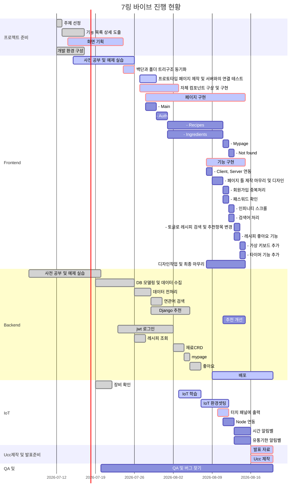

### 깃랩 계정으로 참여하여 깃헙에는 커밋내역이 인정되지 않았음 유의


## 냉장고를부탁해  (싸피 5기 공통프로젝트 우수프로젝트 선정)

---

## :bulb: 목차

- [프로젝트 소개](#프로젝트-소개)   
- [텍스트 ... ](#프로젝트-소개)   
- [프로젝트 명세](#프로젝트-명세)
  - [개발 환경](#개발-환경)
  - [Ganttchart](#Gantt-Chart)
  - [결과물](#결과물)

<br>

<br>

## :book: 프로젝트 소개

- 서비스 설명: 점점 늘어가는 2030 1인가구를 위한 냉장고 매니저이고, 특히 요리에 관심있는 2030 1인가구들의 입장에서 냉장고를 보다 효율적으로 활용할 수 있게 서비스를 제공하는 서비스

- 팀명: 7링바이브
- 트랙 : IoT

### :soccer: 목표

점점 늘어가는 2030 1인가구를 위한 냉장고 매니저이고, 2030 1인가구들의 입장에서 냉장고를 보다 효율적으로 활용할 수 있게 서비스를 제공하고자 함.
<br>

#### :boy: 우리의 페르소나


- 요리에 관심이 있고 레시피 추천이 필요한 사람
- 요리에 관심이 있지만 재료관리를 잘 못하는 사람
- 요리에 크게 관심이 없어 냉동 식품을 쌓아두고 먹는 사람


- 주요 기능: 개인별 맞춤형 서비스 제공, 레시피 활용 서비스, 재료 관리 서비스

  ✅ 사용자별 재료 및 좋아하는 레시피 등록 가능

  ✅ 등록한 내용토대로 2가지 방식으로 추천 레시피 제공 및 레시피 검색 가능

  ✅ 레시피 재료 중 없는 것 표시 및 유통기한 지난 재료 있을 시 알림

- 차별화된 기술:

  ✅ 유저 개인별 맞춤형 추천 서비스 제공

  ✅ 데이터 전처리 후, 더 나아가 연관성 검색 기능을 구현하여 오타있어도 제대로된 결과 도출

  ✅ 시중에 없는 다양한 부가기능 제공(없는 재료 파악, 타이머 등)

  ✅ IoT센서를 활용한 기능 탑재

- 역할: 

  팀장-  (Jira 스프린트 및 이슈 관리, Git flow 관리 및 머지 확인, 진행현황 매일 확인하며 팀장회의 참석, 간트차트 활용하여 팀 일정관리), 

  기획 - (Whimsical을 통한 와이어프레임 제작, 화면정의서 제작), 

  프런트엔드(React) 및 디자인(Material-Ui) 개발,

  발표 

---

#### :envelope_with_arrow: 활용기술스택


주요기술스택: React, Node.js, Django, DB(웹: Mysql, 라즈베리파이: Maria DB), 라즈베리파이, Whimsical, Python, Vanilla JS, vsCode, Chrome Browser, LED, 부저센서

#### :classical_building: ERD


---

## :notebook_with_decorative_cover: 프로젝트 명세

### :house: 개발 환경

#### Front-end [Link](https://lab.ssafy.com/s05-webmobile3-sub3/S05P13B107/-/blob/master/frontend/README.md)

- __Framework__ : React  (Ver : 4.0.3)
- __지원 환경__ : Web / IoT(라즈베리 파이)
- __담당자__ : 차성민, 엄재식
  <br>

#### Back-end [Link](https://lab.ssafy.com/s05-webmobile3-sub3/S05P13B107/-/tree/master/backend)

- __Framework__ : Node.js, Express / Django
- __Database__ : Mysql
- __담당자__ : 박민상, 윤소영, 진지연
  <br>

#### Design

- Material-UI 활용
- __담당자__ : 차성민, 엄재식
  <br>


## :chart_with_upwards_trend: Gantt Chart 



##  :rainbow: 결과물

> #### 결과물 간략 요약 페이지 예시 사진입니다.
>
> ### :star:  회원페이지
>
> 
>
> 
>
> ### :star:  홈페이지
>
> 
>
> 
>
> ### :star:  레시피
>
> 
>
> 
>
> ### :star:  레시피 서치
>
> 
>
> 
>
> ### :star:  레시피 디테일
>
> 
>
> 
>
> ### :star:  유통기한 추천
>
> 


## 기획 산출물


```markdown
UCC: https://drive.google.com/file/d/1IWZLK2Kx22yCSVlsHReYPQaXrGsl-NgR/view?usp=sharing

최종 ppt: https://docs.google.com/presentation/d/1shVhlIhsxN9V1Hzay55PwE47-LzFTyj5/edit?usp=sharing&ouid=104755432594470438671&rtpof=true&sd=true
```